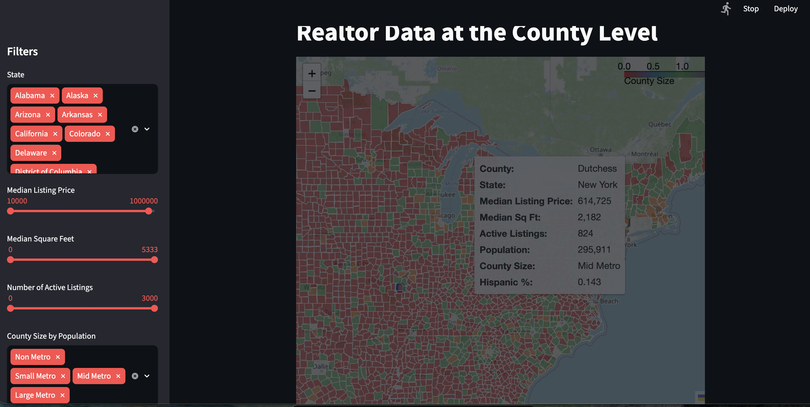
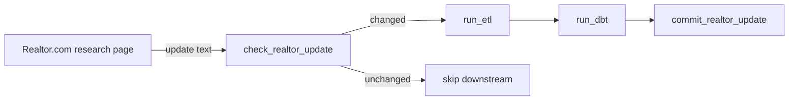
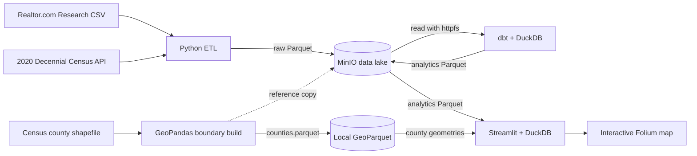

# Real Estate by Census

An end-to-end data engineering project that combines county-level real estate
inventory with U.S. Census demographics and serves the results through an
interactive geospatial application.

The project demonstrates a local, containerized analytics platform built around
Airflow, Python, MinIO, Parquet, dbt, DuckDB, Streamlit, and Folium. It separates
data ingestion, object storage, transformation, and presentation so each layer can
be developed and operated independently.

## End result

A Streamlit dashboard with filterable county-level housing and demographic metrics
on an interactive Folium map:

<p align="center">
  
</p>

## Architecture

### Orchestration

Airflow schedules the daily pipeline and tracks source freshness:



### Data flow

Sources move through extract, lake storage, transform, and the map app:



### Pipeline steps

1. **Extract** — Python retrieves the latest county inventory file published by
   Realtor.com Research and county demographic fields from the 2020 Decennial
   Census PL API.
2. **Standardize** — The ETL layer validates that the Realtor dataset contains a
   single reporting month, normalizes state and county values, handles Census
   naming edge cases, and creates zero-padded county FIPS keys.
3. **Load** — Raw datasets are serialized as columnar Parquet and written to an
   S3-compatible MinIO data lake.
4. **Transform** — dbt uses DuckDB and its `httpfs` extension to query Parquet
   directly from MinIO. Staging models enforce analytics-friendly types and a
   county mart joins housing inventory with demographic data.
5. **Serve** — Streamlit reads the analytics mart directly from object storage,
   joins it to GeoParquet county boundaries, and renders a filterable Folium map.

## Data platform layers

### Orchestration — Apache Airflow

The `realtor_pipeline` DAG models a daily workflow:

```text
check_realtor_update → run_etl → run_dbt → commit_realtor_update
```

`check_realtor_update` is a `ShortCircuitOperator`: it compares the update text on
Realtor.com's research page with the value retained in Airflow Variables. If the
text is unchanged, Airflow skips ETL and dbt. On a change, the new text is held in
XCom until `commit_realtor_update` runs after a successful dbt run, so a failed
pipeline does not permanently mark the source as processed. `catchup=False`
prevents historical backfills when the local platform starts.

### ETL — Python and pandas

The ingestion layer:

- calls the Census API for county-level population and race/ethnicity fields;
- downloads Realtor.com Research's county inventory metrics;
- applies explicit schemas for stable CSV parsing;
- creates a shared five-character county FIPS key;
- normalizes Louisiana parish and Alaska borough/census-area names;
- rejects Realtor extracts containing more than one reporting month; and
- writes in-memory DataFrames to Parquet objects through the MinIO SDK.

### Data lake — MinIO and Parquet

MinIO provides local S3-compatible storage with a simple medallion-style layout:

```text
real-estate-by-census/
├── raw/
│   ├── census/census.parquet
│   └── realtor/realtor.parquet
├── reference/
│   └── counties.parquet
└── analytics/
    └── realtor_county_metrics.parquet
```

Parquet keeps storage portable and columnar, while MinIO decouples producers from
consumers and exposes the same S3 access pattern used by cloud data platforms.

### Transformation — dbt and DuckDB

dbt provides SQL-based transformations and lineage:

```text
raw.census  ──→ stg_census  ──┐
                              ├─→ realtor_county_metrics
raw.realtor ─→ stg_realtor ──┘
```

The final external mart is materialized back to MinIO as Parquet. It includes:

- listing price, inventory, market-duration, square-footage, and pending metrics;
- Census population and race/ethnicity counts;
- derived White, Black, Asian, and Hispanic/Latino population shares;
- population-based county segments from non-metro through large metro; and
- bounded presentation fields for map-friendly price, size, and inventory scales.

DuckDB acts as an embedded analytical engine rather than a long-running database,
keeping the platform lightweight while still supporting SQL transformations over
object storage.

### Presentation — Streamlit and Folium

The application exposes a county-level U.S. map with filters for:

- state;
- median listing price;
- median square footage;
- active listing count; and
- county population segment.

Tooltips combine real estate and demographic attributes, allowing users to explore
how local housing-market conditions vary across communities.

## Technology stack

| Layer | Technology | Responsibility |
| --- | --- | --- |
| Orchestration | Apache Airflow 2.9 | Daily task dependencies and run history |
| Extraction and loading | Python, pandas, requests, MinIO SDK | API/CSV ingestion, validation, normalization, Parquet loading |
| Object storage | MinIO | S3-compatible raw, reference, and analytics zones |
| Transformation | dbt-duckdb, SQL | Staging models, joins, derived metrics, lineage |
| Query engine | DuckDB | In-process analytics over Parquet and S3 |
| Geospatial processing | GeoPandas, GeoParquet | County geometry preparation and joins |
| Data application | Streamlit, Folium | Interactive filtering and county map |
| Runtime | Docker Compose | Reproducible local services and networking |

## Data sources

- [Realtor.com Research Data](https://www.realtor.com/research/data/) — county
  inventory and listing-market metrics.
- [2020 Census Decennial PL API](https://api.census.gov/data/2020/dec/pl.html) —
  county population and race/ethnicity counts.
- [U.S. Census Bureau Cartographic Boundary Files](https://www.census.gov/geographies/mapping-files/time-series/geo/cartographic-boundary.html)
  — county geometries used by the map.

## Repository structure

```text
.
├── airflow/dags/                 # Airflow pipeline definitions
├── data/                         # County source geometry and GeoParquet
├── dbt/
│   ├── models/staging/           # Source-aligned dbt views
│   └── models/marts/             # Joined analytics mart
├── docker/                       # Service-specific container images
├── etl/                          # Extraction, normalization, and MinIO loading
├── streamlit/                    # Interactive geospatial application
└── docker-compose.yml            # Local platform definition
```

## Run locally

### Prerequisites

- Docker with Docker Compose
- A [Census API key](https://api.census.gov/data/key_signup.html)

Create a `.env` file in the repository root:

```dotenv
API_KEY=your_census_api_key
```

Build and start the platform:

```bash
docker compose up --build
```

Local services:

- Airflow: [http://localhost:8080](http://localhost:8080)
- MinIO console: [http://localhost:9001](http://localhost:9001)
- Streamlit: [http://localhost:8501](http://localhost:8501)

The local development credentials for Airflow and MinIO are `admin/admin` and
`minioadmin/minioadmin`, respectively. They are intentionally simple and must be
replaced before deploying outside a development environment.

The data layers can also be run independently:

```bash
# Populate the raw zone after MinIO is running
docker compose run --rm airflow python /opt/airflow/etl/etl.py

# Build the staging models and analytics mart
docker compose run --rm dbt dbt run
```

The repository includes generated county GeoParquet for the application. To rebuild
it from the source shapefile, install the Python dependencies and run:

```bash
python etl/build_county_shapes.py
```

## Engineering decisions

- **FIPS-based integration:** County FIPS is used instead of county names to avoid
  ambiguous or changing natural-language join keys.
- **Open storage format:** Parquet allows dbt, DuckDB, Python, and geospatial tools
  to share data without proprietary storage.
- **External dbt materialization:** The mart is published as an object-storage
  artifact that can be consumed without keeping the transformation engine online.
- **Separation of concerns:** Airflow schedules work, MinIO persists data, DuckDB
  executes analytics, dbt manages transformations, and Streamlit serves users.
- **Containerized development:** Service dependencies and ports are encoded in
  Docker Compose for repeatable local setup.

## Current scope and roadmap

This repository is a local data-platform implementation and portfolio project.
Current improvement opportunities include:

- add dbt schema, relationship, accepted-value, and source-freshness tests;
- add unit and integration tests around FIPS normalization and MinIO I/O;
- add health checks, structured logging, alerting, and retry policies; and
- add CI for Python quality checks, dbt compilation, and automated tests.

In terms of improving data availability, future iterations of this project can provide: 
- historical data 
- entity level profiles (county profile, state profile, city profile, etc.)
- demographic breakdowns. 
 
## Responsible use

Demographic and housing data can reveal structural disparities, but they should not
be used to stereotype communities or make discriminatory housing decisions. This
project is intended for aggregate, county-level exploration and data-engineering
demonstration. It does not model individual behavior or provide housing,
investment, lending, or fair-housing advice.
